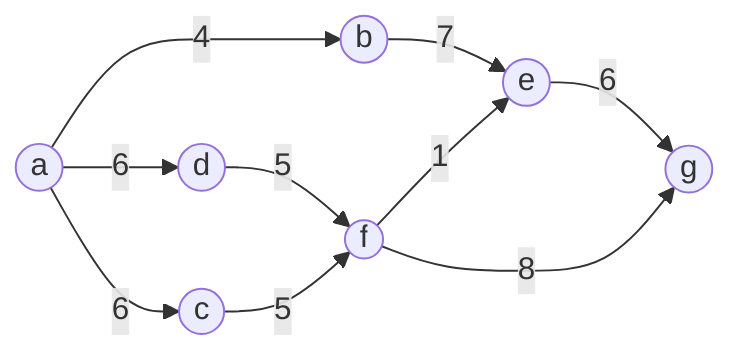
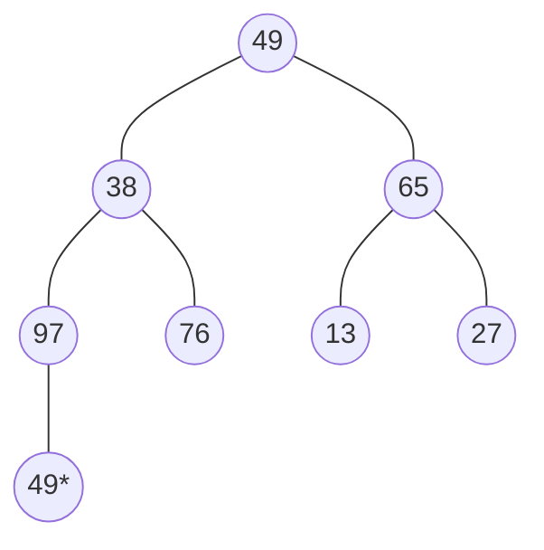
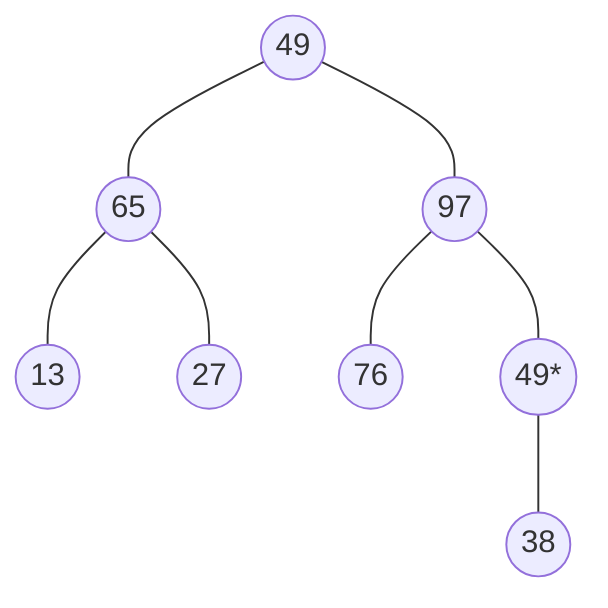
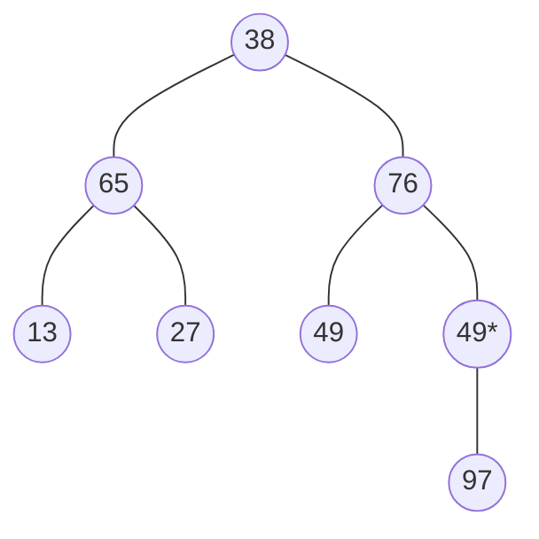
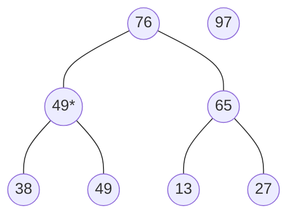
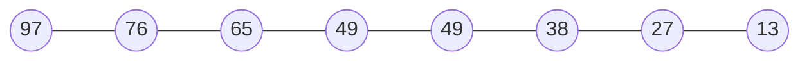

# 线性表

## 链表的基本操作

### 头插法

```c++
s->next = L->next;
L->next = s;
```

### 尾插法

```c++
p->next =s;
p=p->next;
```

### 头插法和尾插法的应用

#### 应用一

##### 尾插法创建链表

```c++
void createlistR(LNode *&L, int a[], int n)
{
    LNode *p, *s;
    int i;
    L = (LNode*)malloc(sizeof(LNode));
    p=L;
    for(i = 0; i < n; ++i)
    {
        s = (LNode*)malloc(sizeof(LNode));
        s->data = a[i];
        p->next = s;
        p = p->next;
    }
    p->next = NULL;
}
```

##### 头插法创建链表

```c++
void createlistH(LNode *&L, int a[], int n)
{
    LNode *s;
    L = (LNode*)malloc(sizeof(LNode));
    L->next = NULL;
    int i;
    for(i = 0; i < n; ++i)
    {
        s = (LNode*)malloc(sizeof(LNode));
        s->data = a[i];
        s->next = L->next;
        L->next = s;
    }
}

```

#### 应用二

##### 用尾插法将两个递增有序的列表合并成一个递增有序的列表

###### 不用新增头结点的情况

```c++
void merge(LNode *&A, LNode *B)
{
    //定义三个个游标
    LNode *pa, *pb, *pr,*pre;
    pa = A->next;
    pb = B-->next;
    pre = B;
    pr = NULL;
    free(B);
    while(pa!==NULL&&pb!=NULL)
    {
        if(pa->data<pb->data)
        {
           pre = pre->next;
           pa = pa->next; 
        }else{
            pr=pb;
            pb = pb->next;
            pr->next=pre->next;
            pre->next=pr;
            pre=pa;
            pa = pa->next;
        }
    }
    if(pb !=NULL) pa->next = pb; 
}
```

###### 新增头结点的情况

```c++
void merge(LNode *A, LNode *B, LNode *&C)
{
    LNode *pa,*pb,*pc;
    C = (LNode*)malloc(sizeof(LNode));
    C=NULL;
    pc=C;
    pa = A->next;
    pb = B->next;
    free(A);
    free(B);
    while(pa!=NULL&&pb!=NULL)
    {
        if(pa->data < pb->data)
        {
            pc->next = pa;
            pa = pa->next;
            pc = pc->next;
        }else{
            pc->next = pb;
            pb = pb->next;
            pc = pc->next;
        }
    }
    pc->next=NULL;
    if(pa!=NULL) pc->next = pa;
    if(pb!=NULL) pc->next = pb;
}
```

##### 用头插法将两个递增有序的序列合并成递减有序的序列

```c++
void merge(LNode *A, LNode *B, LNode *&C)
{
    LNode *pa, *pb,*s;
    C = (LNode*)malloc(sizeof(LNode));
    C=NULL;
    pa = A ->next;
    pb = B ->next;
    free(A);
    free(B);
    while(pa!=NULL&&pb!=NULL)
    {
        if(pa->data < pb->data)
        {
            s = pa; 
            pa = pa->next;
            s->next = C->next;
            C->next = s;
        }else{
            s = pb;
            pb = pb->next;
            s ->next = C->next;
            C->next = s;
        }
    }
    while(pa!=NULL)
    {
        s = pa;
        pa = pa->next;
        s->next = C->next;
        C->next = s;
    }
    while(pb!=NULL)
    {
        s = pb;
        pb = pb->next;
        s->next = C->next;
        C->next = s;
    }
}
```

### 顺序表的逆置

```c++
void reverse(int a[], int left, int right)
{
    for(int i = left, j = right; i<j; ++i,--j)
    {
        int temp = a[i];
        a[i] = a[j];
        a[j] = temp;
    }
}
```

# 栈和队列

## 栈

### 栈的几种状态

#### 栈空

##### 顺序栈

```c++
s.top == -1
```

##### 链栈

```c++
lst->next=NULL;
```

#### 栈满

##### 顺序栈

```c++
s.top = MaxSize -1;
```

##### 链栈

```c++
从逻辑上来说，链栈没有栈满的情况
```

#### 非法状态

上溢：栈满，继续进栈。

下溢：栈空，继续出栈。

### 栈的两个操作

#### 进栈

##### 顺序栈

```c++
s.data[++s.top] = x;
```

##### 链栈

```c++
s->next = lst->next;
lst->next = s;
```

#### 出栈

##### 顺序栈

```c++
x = s.data[s.top--];
```

##### 链栈

```c++
p = lst->next;
x = p->data;
lst->next = p->next;
free(p);
```

### 循环队列

#### 顺序队列的假溢出

是指顺序队列经过一系列的进队和出队后，头尾指针都指向数组末端，虽然队中没有元素，但任然无法让元素进队，这就“假溢出”现象。解决“假溢出”现象的方法是，将顺序队列构造成环状，这样头尾指针可以沿着环头，这样就永远不会出现两者来到数组尽头无法继续往下走的情况，这就是循环队列。

#### 循环队列的两个状态

##### 队空状态

```c++
qu.rear == qu.front;
```

##### 队满状态

```c++
(qu.rear+1)%MaxSize = qu.front;
```

#### 循环队列的两种操作

##### 进队

```c++
qu.rear = (qu.rear+1)%MaxSize; qu.data[qu.rear] = x;
```

##### 出队

```c++
qu.front = (qu.front+1)%MaxSize; x = qu.data[qu.front];
```

### 抽象数据类型(ADT)

```c++
ADT name
{
    数据对象集:
    	对象1；对象2; ... 对象n;
    数据关系集:
    	数据关系1={<对象1， 对象2>,<对象2，对象n>, ..., <对象n-1, 对象n>}
        数据关系2={树， 图， 线性表， 集合}
    数据操作集：
        操作1;操作2; ... 操作n;
        
}
```

# 树、二叉树和森林

## 树

## 二叉树

### 二叉树的遍历

#### 递归版

##### 先序遍历

```c++
void preorder(BTNode *p)
{
    visit(p);
    preorder(p->lchild);
    perorder(p->rchild);
}
```

##### 中序遍历

```c++
void inorder(BTNode *p)
{
    inorder(p->lchild);
    visit(p);
    inorder(p->rchild);
}
```

##### 后序遍历

```c++
void postorder(BTNode *p)
{
    postorder(p->lchild);
    postorder(p->rchild);
    visit(p);
}
```

##### 后序遍历的应用

###### 计算算术表达式的值

> **思路分析**：先将算术表述存储到二叉树中，然后先计算左子树的值，再计算右子树的值，然后将得到的两个值计算出来，等到最后的值，这正好对应先遍历左子树，再遍历右子树，最后访问根节点的后序遍历。

```c++
int op(char a, char b, char o)
{
    switch(o)
    {
        case '+': return a+b;
        case '-': return a-b;
        case '*': return a*b;
        case '/': return a/b;
    }
}

int comp(BTNode *p)
{
	int A,B;
    if(p!=NULL)
    {
        if(p->lchild!=NULL&&p->lchild!=NULL)
        {
            A=comp(p->lchild);
            B=com(p->rchild);
            return op(A,B,p->data);
        }else return p->data-'0';
    }else return 0;
    
}
```

###### 求一棵二叉树的深度

>**分析思路：**整棵树的的深度D=max{LD,RD}+1，所以先求出左子树的深度，再求出右子树的深度，然后比较两者的大小后加1，最后得到整棵树的深度。整个过程正好对应后序遍历。

```c++
int getDepth(BTNode *p)
{
    int LD,RD;
    if(p!=NULL)
    {
        LD = getDepth(p->lchild);
        RD = getDepth(p->lchild);
        return ((LD>RD)?LD:RD)+1;
    } 
    return 0;
}
```

##### 层序遍历

```c++
void level(BTNode *p)
{
    BTNode qu[MaxSize];
    int front,rear;
    front=rear=0;
    BTNode* q;
    if(p!=NULL)
    {
        rear=(rear+1)%MaxSize;
        qu[rear] = p;
        Visit(p);
        while(front!=rear)
        {
            front = (front+1)%MaxSize;
            q = qu[front];
            if(q->lchild!=NULL)
            {
                rear = (rear + 1)%MaxSize;
                qu[rear] = q->lchild;
            }
            if(q->rchild!=NULL)
            {
                rear = (rear+1)%MaxSize;
                qu[rear] = q->rchild;
            }
        }
    }
    
}
```

##### 层序遍历的应用

###### 求二叉树的宽度

```c++
typedef struct{
    BTNode *p;
    int lno;
}St;
int maxNode(BTNode *p)
{
    int front=0,rear=0,Lno=0;
    St que[MaxSize];
    BTNode *q;
    if(p!=NULL)
    {
        ++rear;
        que[rear].p=p;
        que[rear].lno=1;
        while(rear!=front)
        {
            ++front;
            q=que[front].p;
            Lno = que[front].lno;
            if(q->lchild!=NULL)
            {
                ++rear;
                que[rear].p=q->lchild;
                que[rear].lno = Lno+1;
            }
            if(q->rchild!=NULL)
            {
                ++rear;
                que[rear].p = q->rchild;
                que[rear].lno = Lno+1;
            }
        }
        int max = 0;
        for(int i= 1;i <= Lno; ++i)
        {
            int n = 0;
            for(int j=0; j<rear; ++j)
                if(que[j].lno == i) ++n;
            if(n>max)  max=n;
         }
        return max;
    }
    return 0;
}
```

#### 非递归版

##### 先序遍历

```c++
void preorderNonRecurision(BTNode *p)
{
    if(p!=NULL)
    {
        BTNode* Stack[MaxSize];
        BTNode* q;
        int top = -1;
        Stack[++top] = p;
        while(top!=-1)
        {
            q = Stack[top--];
            visit(p);
            if(q->rchild) Stack[++top] = q->rchild;
            if(q->lchild) Stack[++top] = q->lchild;
        }
    }
}
```

##### 中序遍历

```c++
void inorderNonRecurision(BTNode *p)
{
    if(p!=NULL)
    {
        BTNode *stack[MaxSize];
        BTNode *q;
        int top = -1;
        q=p;
        while(top!=-1||q!=NULL)
        {
            while(q!=NULL)
            {
                stack[++top] = q;
                q= q->lchild;
            }
            if(top!=-1)
            {
                q = stack[top--];
                visit(p);
                p = p->rchild;
            }
        }
    }
}
```


##### 后序遍历

> 逆后序遍历是先序遍历过程中对左右子树遍历顺序交换所得的结果。
>
> 因此，逆后序遍历经过逆序后就等到了后序遍历。

```c++
void postorderNonRecurision(BTNode *p)
{
    if(P!=NULL)
    {
        BTNode *s1[MaxSize],*s2[MaxSize];
   		BTNode *q;
    	int top1=-1,top2=-1;
        s1[++top1] = p;
        while(top!=-1)
        {
           q = s1[top1--];
           s2[++top2] = q;
            if(q->lchild) s1[++top1] = q->lchild;
            if(q->rchild) s1[++top1] = q->rchild;
        }
        while(top2!=-1)
        {
            q = s2[top2--];
            visit(q);
        }       
    }  
}
```

#### 二叉树线索化

```c++
typedef TBTNode{
    int data;
    int ltag,rtag;
    TBTNode *lchild, *rchild;
}TBTNode;
```

##### 中序遍历对二叉树线索化

```c++
void InThread(TBTNode *p ,TBTNode* pre)
{
    if(p!=NULL)
    {
        InThread(p->lchild, pre);
        if(p->lchild==NULL)
        {
            p->lchild = pre;
            p->ltag = 1;
        }
        if(pre!=NULL&&pre->rchild==NULL)
        {
            pre->rchild = p;
            pre->rtag = 1;
        }
        pre = p;
        InThread(p->rchild, pre);
    }
}
```

##### 通过中序遍历建立中序线索二叉树

```c++
void createInThread(TBTNode *root)
{
    TBTNode *pre=NULL;
    if(root != NULL)
    {
        InThread(root, pre);
        pre->rchild = NULL;
        pre->rtag = 1;
    }
    
}
```

##### 先序遍历对二叉树线索化

```c++
void PreThread(TBTNode *p, TBTNode *pre)
{
    if(p!=NULL)
    {
        if(p->lchild==NULL)
        {
            p->lchild = pre;
            p->ltag = 1;
        }
        if(pre!=NULL&&pre->lchild==NULL)
        {
            pre->rchild = p;
            p->rtag = 1;
        }
        pre = p;
        PreThread(p->lchild,pre);
        PreThread(p->rchild, pre);
    }
}
```

##### 后续遍历对二叉树线索化

```c++
void PostThread(TBTNode *p, TBTNode *pre)
{
    if(p!=NULL)
    {
        PostThread(p->lchild, pre);
        PostThread(p->rchild, pre);
        if(p->lchild==NULL)
        {
            p->lchild = pre;
            p->ltag = 1;
        }
        if(pre!=NULL&&pre->lchild==NULL)
        {
            pre->rchild = p;
            p->rtag = 1;
        }
        pre = p;
    }
}
```

# 图

## 存储结构

### 邻接矩阵

```c++
typedef sturct{
    int adj[MaxSize][MaxSize];
    int n;
    int vex[MaxSize];
}MGraph;
```

### 邻接表

```c++
typedef struct ArcNode{
    int adjvex;//边所指向的结点位置
    struct ArcNode* nextarc;//指向下一条边的指针
    int info；
}ArcNode;
typedef struct 
{
    char data;
    ArcNode *firstarc;
}VNode;
typedef struct{
    VNode* adjlist[MaxSize];//邻接表
    int n,e;//定点数和边数
}AGraph
```

### 图的遍历操作

#### 深度优先遍历

##### 以邻接表为存储结构的深度优先遍历

```c++
void DFS(AGraph *G, int v0)
{
    int Visited[MaxSize]={0};
    ArcNode *p;
    Visited[v0] = 1;
    Visit(v0);
    p = G->adjlist[v0]->firstrac;//p指向第一条边
    while(p!=NULL)
    {
        if(Visited[p->adjvex] == 0)
            DFS(G, p->adjvex);
        p = p->nextarc;
        
    }
}
```

##### 以邻接矩阵为存储结构的深度优先遍历

```c++
int Visited[MaxSize];
void DFSTraverse(MGraph *G)
{
    for(int v = 0; v< G->n; ++v)
        Visited[v] = 0;
    for(int v = 0; v<G-->n;++v)
        DFS(G,v);
    
}
void DFS(MGraph *G, int v0)
{
    Visited[v0] = 1;
    Visit(v0);
    for(int i = 0; i < n; ++i)
    {
        if(G->edges[v0][i]!=INF&&Visited[i]==0)
            DFS(G, i);
    }
}
```

##### 以邻接表为存储结构的广度优先遍历

```c++
void BFS(AGraph *G, int v, int visited[MaxSize])
{
    ArcNode* p;
    int que[MaxSize],front=0,rear=0;
    int j;
    Visit(v);
    visited[v]=1;
    rear = (rear+1)%MaxSize;
    que[rear] = v;
    while(rear!=front)
    {
        front = (front+1)%MaxSize;
        j = que[front];
        p = G->adjlist[j]->firstarc;
        while(p!=NULL)
        {
            if(visited[p->adjvex] == 0)
            {
                Visit(p->adjvex);
                visited[p->adjvex] = 1;
                rear = (rear+1)%MaxSize;
                que[rear] = p->adjvex;
            }
            p = p->nextarc;
        }
    }
}

```


##### prim

```c++
void Prim(MGraph *G, int v0, int &sum)
{
    int vset[maxsize],lowcast[maxisze], v = v0;
    int i, j, k, min;
    for(i = 0; i < G->n; ++i)
    {
        lowcast[i] = G->edges[v0][i];
        vset[i] = 0;
    }
    vset[v0] = 1;
    sum = 0;
    for(i = 0; i < G->n-1; ++i)
    {
        min = INF;
        for(j = 0; j < G->n; ++j)
            if(vset[j]==0&&lowcast[j] < min)
            {
                min = lowcast[j];
                k = j;
            }
        vset[k] = 1;
        v = k;
        sum += min;
        for(j = 0; j < G->n; ++j)
            if(vset[j]==0&&G->edges[v][j]<lowcast[j])
                lowcast[j] = G->edges[v][j];
    }  
}
```

##### kruskal

```c++
typedef struct{
    int a, b;//边的起点和终点
    int w;//边的权值
}Road;
Road road[maxsize];
int v[maxsize];//定义并查集
int getRoot(int a)
{
    while(a != v[a]) a = v[a];
    return a;
}
void kruskal(MGraph *G, int &sum, Road road[])
{
    int i;
    int a,b;
    sum = 0;
    for(i = 0; i < G->n; ++i) v[i] = i;
    sort(road, G->e);
    for(i = 0; i < G->e; ++i)
    {
        a = getRoot(road[i].a);
        b = getRoot(road[i].b);
        if(a!=b)
        {
            v[a] = b;
            sum += road[i].
        }
    }
    
}
```

##### dijkstra




|      | 第一轮                                                       | 第二轮                                                | 第三轮                                                | 第四轮                                                   | 第五轮                                                   | 第六轮                              |
| ---- | ------------------------------------------------------------ | ----------------------------------------------------- | ----------------------------------------------------- | -------------------------------------------------------- | -------------------------------------------------------- | ----------------------------------- |
| b    | <font color = red size=6>4</font><br> <font color=red>a-b</font> |                                                       |                                                       |                                                          |                                                          |                                     |
| c    | <font size =5>6</font><br>a-c                                | <font color=red><font size =5>6</font><br/>a-c</font> |                                                       |                                                          |                                                          |                                     |
| d    | <font size =5>6</font><br>a-d                                | <font size =5>6</font><br/>a-d                        | <font color=red><font size =5>6</font><br/>a-d</font> |                                                          |                                                          |                                     |
| e    | INF<br>a-e                                                   | <font size =5>11</font><br/>a-b-e                     | <font size =5>11</font><br/>a-b-e                     | <font color=red><font size =5>11</font><br/>a-b-e</font> |                                                          |                                     |
| f    | INF<br>a-f                                                   | INF<br/>a-f                                           | <font size =5>11</font><br/>a-c-f                     | <font size =5>11</font><br/>a-c-f                        | <font color=red><font size =5>11</font><br/>a-c-f</font> |                                     |
| g    | INF<br>a-g                                                   | INF<br/>a-g                                           | INF<br/>a-g                                           | INF<br/>a-g                                              | <font size =5>17</font><br/>a-b-e-g                      | <font size =5>17</font><br/>a-b-e-g |
| 集合 | b                                                            | b c                                                   | b c d                                                 | b c d e                                                  | b c d e f                                                | b c d e f g                         |

##### floyd

> 1) 设置两个矩阵A和Path，初始时将图的连接矩阵赋值给A，将矩阵Path中所有的元素赋值为-1.
> 2) 以顶点k为中间点，k取0~n-1对图中所有顶点对{i,j}进行如下检测和修改：如果$A[i][j] > A[i][k] + A[k][j]$的值，将$A[i][j] $改为$A[i][k] + A[k][j]$的值，将$Path[i][j]$改为k, 否则什么都不做。

###### 打印任意两点间的最短路径

```c++
void printPath(int u, int v, int path[][maxsize], int A[][maxsize])
{
    if(A[u][v]==INF)
        return;
    else{
        if(path[u][v] == -1)
        {
           cout<<"<"<<u<<","<<v<<">;";
        }else{
            int mid = path[u][v];
            printPath(u, mid, path, A);
            printPath(mid, v, path, A);
        }
    }
}
```

###### floyd算法的实现

```c++
void Floyd(MGraph *G, int Path[][maxsize], int A[][maxsize])
{
    for(int i = 0; i < G->n, ++i)
    	for(int j = 0; j < G->n; ++j)
        {
            Path[i][j] = -1;
            A[i][j] = G->edges[i][j];
        }
    for(int k = 0; k < G->n; ++k)
        for(int i = 0; i < G->n; ++i)
            for(int j = 0; j < G->n; ++j)
                if(A[i][j] > A[i][k] + A[k][j])
                {
                    A[i][j] = A[i][k] + A[k][j];
                    path[i][j] = k;
                }
}
```

##### 实现用邻接表存储的图的拓扑排序

```c++
typedef struct{
    int arcvex;
    struct ArcNode* nextarc;
    int info;
}ArcNode;
typedef struct{
    char data;
    int count;
    ArcNode* firstarc;
}VNode;
typedef struct{
    VNode* adjlist[maxsize];
    int n,e;
}

int TopSort(AGraph *G)
{
    int stack[maxsize],top = -1, n=0;
    ArcNode* p;
    for(int i = 0; i < G->n; ++i)
    {
        if(G->adjlist[i]->count == 0)
            stack[++top] = i;
    }
    while(top != -1)
    {
        int v =stack[top--];
        ++n;
        cout << v<<" ";
        p = G->adjlist[v]->firstarc;
        while(p!=NULL)
        {
            int v1 = ->adjvex;
            --(G->adjlist[v1]->count);
            if(G->adjlist[v1]->count == 0)
                stack[++top] = v1;
            p = p->nextarc;
        }
    }
    if(G->n == n)
        return 1;
    return 0;
}
```

##### 关键路径的求法

> 1. 先求事件的最早发生时间（$ve(j) =max\{ve(i)+a_k\}$）
> 2. 其次，求出事件的最晚发生时间($vl(i) = min\{vl(j)-a_k\}$)
> 3. 最后，求出活动的最早发生时间和最晚发生时间
>    1. 活动的最早发生时间 = 该活动的起始事件的最早发生时间（$e(a_k) = ve(i)$）
>    2. 活动的最晚发生时间 = 该活动的终止事件的最晚发生时间 - 该活动的持续时间($l(a_k) = vl(j) - a_k$)
>
> **TODO:**在（1）之前要对图进行拓扑排序，在（3）之前要对图进行逆拓扑排序

# 排序

## 插入类排序

### 直接插入排序（时间复杂度与待排序列的初始序列有关）

```c++
void InsertSort(int a[], int n)
{
    int tmp=0;
    for(int i = 1; i<n; ++i)
    {
        tmp = a[i];
        j = i-1;
        while(j>=0&&temp<R[j])
        {
            R[j+1] = R[j];
            --j;
        }
        R[j+1] =temp;
    }
}
void InsertSort(int a[], int n)
{
    for(int i=1;i<n;i++)
    {
        int temp=a[i];
        for(int j=i-1;j>=0;--j)
        {
            if(temp<a[j]) a[j+1] = a[j];
        }
        a[j+1] = temp;
    }
}
```

### 折半插入排序（关键字比较次数与初始序列无关）

```c++
void BinaryInsSort(int a[], int n)
{
    int tmp=0, low=0, high=0, mid=0;
    for(int i = 1; i<n;++i)
    {
        low = 0;
        high = i -1;
        tmp = a[i];
        while(low<=high)
        {
            mid = (low+high)/2;
            if(a[mid] > tmp) high = mid-1;
            else low = mid + 1;
        }
        for(int j = i-1; j>=high+1; --j)
            a[j+1] = a[j];
        a[high+1] = tmp;
    }
    
}
```

### 希尔排序(仅用于顺序存储结构)

```c++
void shell(int a[], int n)
{
    int tmp;
    for(int dk = n/2; dk>=1; dk/=2)
        for(int i = dk; i<n; ++i)
        {
            if(a[i]<a[i-dk])
            {
                a[i] = tmp;
                for(int j = i - dk; j>=0&&tmp<a[j];j-=dk)
                    a[j+dk] = a[j];
                a[j+dk] = tmp;
            }
        }
}
```

## 交换类排序

### 起泡排序

```c++
void BubbleSort(int a[], int n)
{
    int tmp=0, flag=0;
    for(int i=n-1; i>=1; ++i)
    {
       flag=0;
        for(int j = 1; j<=i; ++j)
            if(a[j-1]>a[j])
            {
                tmp = a[j-1];
                a[j-1] = a[j];
                a[j] = tmp;
                flag = 1;
            }
        if(flag == 1)
            return;    
    }
}
```

### 快速排序

```c++
void QuickSort(int a[], int low, int high)
{
    int tmp=0;
    int i=low, j=high;
    if(low<high)
    {
        tmp=a[low];
        while(i<j)
        {
            while(i<j&&a[j]>=temp) --j;
            if(i<j)
            {
                a[i] = a[j];
                ++i;
            }
            while(i<j&&a[i]<temp) ++i;
            if(i<j)
            {
                a[j] = a[i];
                --j;
            }
        }
        R[i] = tmp;
        QuickSort(a, low, i-1);
        QuickSort(a, i+1, high);
    }
}
```


## 选择类排序

### 简单选择排序

```c++
void SelectSort(int a[], int n)
{
    int tmp,k;
    for(int i=0; i<n; ++i)
    {
        k = i;
        for(int j = i+1; j<n; ++j)
            if(a[k]>a[j])
                k = j;
        tmp = a[k];
        a[k] = a[i];
        a[i] = tmp;
    }
                
}
```

### 堆排序

初始序列：49 38 65 97 76 13 27 49

建堆



根据大根堆的定义调整堆,从堆的底部开始调整




调整完成后，符合大根堆的定义。开始堆排序

将97从堆中取出，调整堆



删除97，调整堆



然后依次类推，最后得到最终排序




## 归并类排序

```c++
void mergeSort(int a[], int low, int high)
{
    if(low<high)
    {
        int mid = (low+high)/2;
        mergeSort(a, low, mid-1);
        mergeSort(a, mid+1, high);
        merge(A, low, mid, high);
    }
}
```


## 基数类排序

## 最佳归并树：m叉哈夫曼树

## 败方树

## 内部排序总结

| 排序类型     | 最好时间复杂度 | 平均时间复杂度 | 最坏时间复杂度 | 空间复杂度 | 稳定性 |
| ------------ | -------------- | -------------- | -------------- | ---------- | ------ |
| 直接插入排序 | O(n)           | O(n^2)         | O(n^2)         | O(1)       | 稳定   |
| 折半插入排序 | O(n^2)         | O(n^2)         | O(n^2)         | O(1)       | 稳定   |
| 希尔排序     | O(n^1.5)       | O(n^1.5)       | O(n^1.5)       | O(1)       | 不稳定 |
| 起泡排序     | O(n)           | O(n^2)         | O(n^2)         | O(1)       | 稳定   |
| 快速排序     | O(nlogn)       | O(nlogn)       | O(n^2)         | O(logn)    | 不稳定 |
| 简单选择排序 | O(n^2)         | O(n^2)         | O(n^2)         | O(1)       | 不稳定 |
| 堆排序       | O(nlogn)       | O(nlogn)       | O(nlogn)       | O(1)       | 不稳定 |
| 二路归并排序 | O(nlogn)       | O(nlogn)       | O(nlogn)       | O(n)       | 稳定   |
| 基数排序     | O(d(n+r_d))    | O(d(n+r_d))    | O(d(n+r_d))    | O(rd)      | 稳定   |

1. 经过一趟排序，能够保证一个关键字达到最终位置——交换类(起泡排序和快速排序)和选择类排序(简单选择排序和堆排序)
2. 关键字比较次数与初始序列无关——简单排序和折半插入排序
3. 排序趟数与原始序列有关——交换类排序（起泡排序和快速排序）
