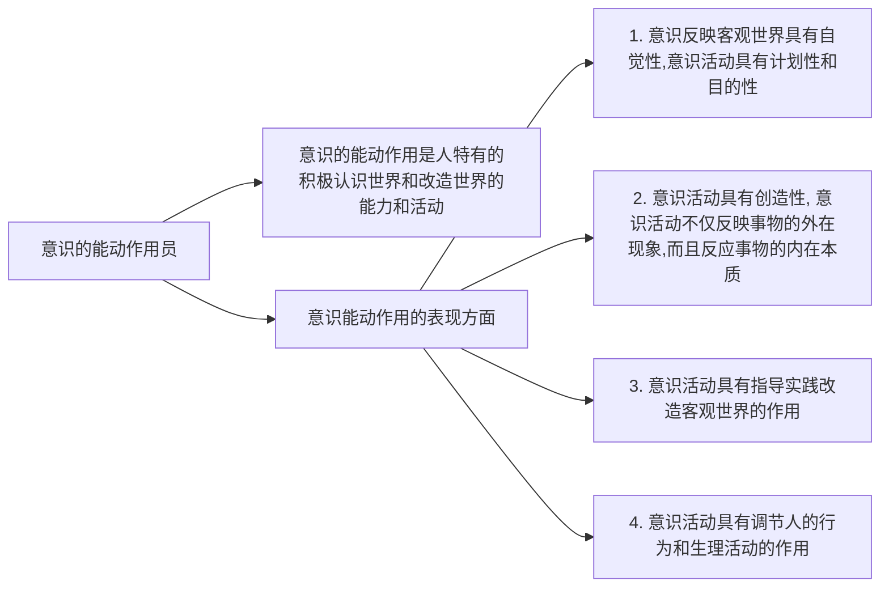
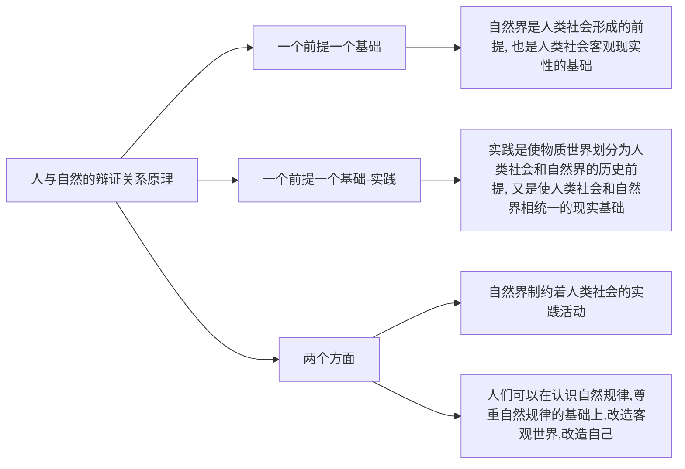
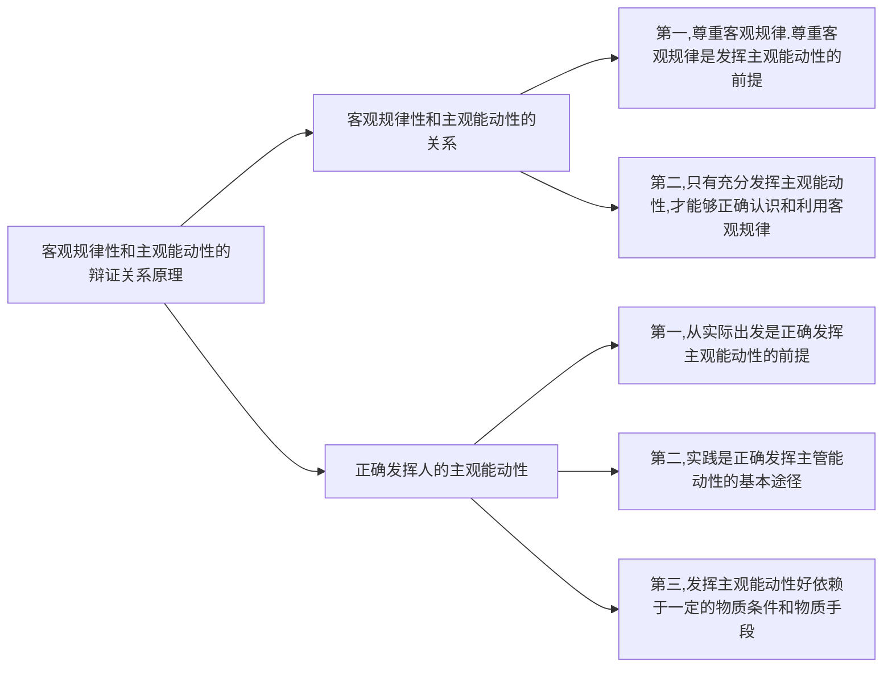
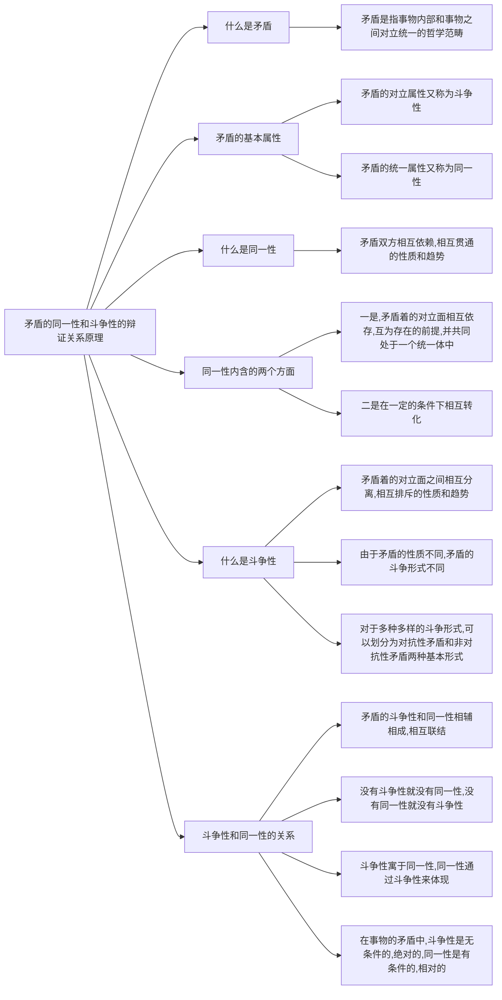

# 马克思基本原理

## 一、意识的能动作用原理

>**背诵逻辑**：
>
>1、意识能动作用的定义
>
>2、意识能动作用的表现（自觉性、创造性、指导实践、调节人的行为和生理活动）

### 背诵思维导图

### 背诵主体内容

意识的能动作用是指人特有的积极认识世界和改造世界的能力和活动。

主要表现在，

一、意识反映客观世界具有自觉性，意识活动具有目的性和计划性。

二、意识活动具有创造性，意识活动不仅反映事物的外部现象，而且反映事物的内部规律和本质。

三、意识活动具有指导实践改造客观世界的作用。

四、意识活动具有调节人的行为和生理活动的作用。

## 二、人与自然的辩证关系原理（两个前提、两个基础、两个方面）

>**背诵逻辑**
>
>一前提一基础（自然界和人类的关系）
>
>另一个一前提一基础（实践方面来说的）
>
>两个方面（主要说明自然界对人类的约束性）

### 背诵思维导图

### 背诵主义内容

自然界是人类社会形成的前提，也是人类社会客观现实性的基础。

实践是使物质世界划分为人类社会和自然界的历史前提，又是使人类社会和自然界相统一的现实基础。

自然界制约着人类社会的实践活动。

人们可以在认识自然规律，尊重自然规律的基础上，改造客观世界，改造自己。

## 三、客观规律性和主观能动性的辩证关系原理

> **背诵逻辑**
>
> 客观规律性和主观能动性的关系
>
> 如何发挥主观能动

### 背诵思维导图

### 背诵主体内容

客观规律性和主观能动性的关系：

第一，尊重客观规律。尊重客观规律是充分发挥主观能动性的前提。

第二，只有充分发挥主观能动性，才能够正确认识和利用客观规律。

正确发挥主观能动性：

第一，从实际出发是正确发挥主观能动性的前提。

第二，实践是正确发挥主观能动性的基本途径。

第三，发挥主观能动性还依赖于一定的物质条件和物质手段。

## 四、矛盾的同一性和斗争性辩证关系原理

> **背诵逻辑**
>
> 什么是矛盾-->矛盾的基本属性--->什么是同一性--->什么是斗争性--->同一性和斗争性的关系

### 背诵思维导图

### 背诵主体内容

矛盾是事物内部和事物之间对立统一关系的哲学范畴。

矛盾的对立统一是矛盾的两个基本属性，矛盾的对立属性又称为斗争性，矛盾的统一属性又称为同一性。

矛盾的同一性：矛盾双方相互依赖、相互贯通的性质和趋势。他有两个面的含义，一是矛盾着的对立面之间相互依存、互为存在的前提，并共同处于一统一体中，二是，在一定条件相互转化。

矛盾的斗争性：矛盾着对立面之间相互分离、相互排斥的性质和趋势。由于矛盾的性质不同，矛盾的斗争形式也不同。由于多种多样的斗争形式，可以把矛盾划分为对抗性矛盾和非对抗性矛盾两种基本形式。

矛盾斗争性和同一性的关系

矛盾的斗争性和同一性相辅相成、相互连结。

没有斗争性就没有同一性，没有同一性就没有斗争性。斗争性寓于同一性，同一性通过斗争性表现出来。在事物的矛盾中，斗争性是无条件的、绝对的，同一性是有条件的、相对的。

